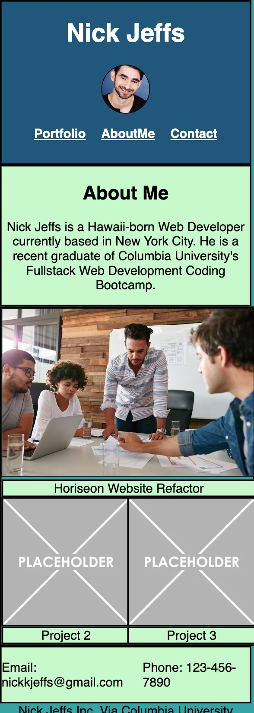

# portfolio

## User Story
* I want a portfolio that makes my previous works accessible and pleasing to the eye. 
* I want a landing page that is easy to navigate
* I want my contact information to be readily available

## Acceptance Criteria
GIVEN I need to sample a potential employee's previous work

WHEN I load their portfolio
THEN I am presented with the developer's name, a recent photo or avatar, and links to sections about them, their work, and how to contact them -->

WHEN I click one of the links in the navigation
THEN the UI scrolls to the corresponding section -->

WHEN I click on the link to the section about their work
THEN the UI scrolls to a section with titled images of the developer's applications -->

WHEN I am presented with the developer's first application
THEN that application's image should be larger in size than the others

WHEN I click on the images of the applications
THEN I am taken to that deployed application

WHEN I resize the page or view the site on various screens and devices
THEN I am presented with a responsive layout that adapts to my viewport

## How To Use

* Open Webpage
* Use navigation buttons (Portfolio, AboutMe, Contact) to be directed to the section you'd like to view.
* Click on the image above "Horiseon Website Refactor" to be directed to the deployed project. 
* Contact information is at the bottom of there are any questions

## What I Learned

* I learned that Mobile First is extremely important for responsive layouts, and is considerably easier to execute that Desktop/Laptop First. 
* Most times it is easier to make attributes responsive by assigning them with percent values, though some situations require pixel values for more precision. 
* This project was crucial for me learning and familiarizing myself with the Box Model. 

## Link to Deployed Application

## Comments

* Some of my elements are slightly off-center or just mis-sized, such as my Main project width, or my contact box. I chose to submit the project rather than submit it even later than it already is. 
